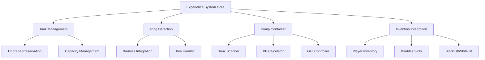

# Design Document: Experience System Improvements

## Overview

This design addresses critical issues in the Minecraft 1.12.2 mod's experience system by implementing comprehensive improvements to experience tank upgrades, ring detection, pump controller functionality, and inventory integration. The solution provides a unified experience management system that works seamlessly across player inventory, hotbar, and Baubles accessory slots.

## Architecture

The system follows a modular architecture with clear separation of concerns:



## Components and Interfaces

### Experience Tank Manager

**Purpose**: Manages experience tank operations including upgrades and capacity handling.

**Key Methods**:
- `preserveExperienceOnUpgrade(ItemStack oldTank, ItemStack newTank)`: Transfers stored XP during upgrades
- `validateCapacity(int storedXP, int maxCapacity)`: Ensures stored XP doesn't exceed tank limits
- `getStoredExperience(ItemStack tank)`: Retrieves current stored XP amount

**Integration Points**:
- Crafting system for upgrade detection
- NBT data management for XP storage
- Capacity configuration system

### Ring Detection System

**Purpose**: Provides unified ring detection across all inventory locations including Baubles slots.

**Key Methods**:
- `scanForRings(EntityPlayer player)`: Comprehensive ring search across all locations
- `handleKeyPress(KeyInputEvent event)`: Processes K key input for ring activation
- `getBaublesRings(EntityPlayer player)`: Specifically scans Baubles ring slots
- `prioritizeRings(List<ItemStack> rings)`: Handles multiple ring selection logic

**Integration Points**:
- Baubles API for accessory slot access
- Minecraft key binding system
- Ring item identification system

### Experience Pump Controller

**Purpose**: Central controller for experience extraction, injection, and tank management.

**Key Methods**:
- `scanAllInventories(EntityPlayer player)`: Detects tanks across all inventory types
- `calculateTotalCapacity(List<ItemStack> tanks)`: Computes combined tank capacity
- `processScrollInput(int scrollDelta, boolean isExtraction)`: Handles fine-tuning controls
- `performExperienceOperation(int amount, boolean isExtraction)`: Executes XP transfer

**Integration Points**:
- XP calculation system
- GUI rendering system
- Mouse input handling
- Tank detection across inventories

### Inventory Integration Layer

**Purpose**: Provides unified access to different inventory systems.

**Key Methods**:
- `getPlayerInventoryTanks(EntityPlayer player)`: Scans player inventory slots
- `getHotbarTanks(EntityPlayer player)`: Scans hotbar slots  
- `getBaublesTanks(EntityPlayer player)`: Scans Baubles accessory slots
- `refreshInventoryState(EntityPlayer player)`: Updates cached inventory data

**Integration Points**:
- Minecraft player inventory system
- Baubles mod API
- Inventory change event system

## Data Models

### Experience Tank Data Structure

```java
public class ExperienceTankData {
    private int storedExperience;     // Current XP stored
    private int maxCapacity;          // Maximum XP capacity
    private int tankTier;             // Tank upgrade tier
    private UUID tankId;              // Unique identifier
    
    // NBT serialization methods
    public NBTTagCompound writeToNBT();
    public void readFromNBT(NBTTagCompound nbt);
}
```

### Ring Detection Result

```java
public class RingDetectionResult {
    private List<ItemStack> foundRings;      // All detected rings
    private Map<String, ItemStack> ringsByType; // Rings categorized by type
    private ItemStack primaryRing;           // Selected primary ring
    private InventoryLocation location;      // Where ring was found
}
```

### Tank Scan Result

```java
public class TankScanResult {
    private List<ItemStack> allTanks;        // All detected tanks
    private int totalCapacity;               // Combined capacity
    private int totalStored;                 // Combined stored XP
    private Map<InventoryType, List<ItemStack>> tanksByLocation;
}
```

## Correctness Properties

*A property is a characteristic or behavior that should hold true across all valid executions of a system-essentially, a formal statement about what the system should do. Properties serve as the bridge between human-readable specifications and machine-verifiable correctness guarantees.*

Based on the prework analysis and property reflection, here are the consolidated correctness properties:

**Property 1: Experience Tank Upgrade Preservation**
*For any* experience tank with stored XP, upgrading the tank should preserve the original stored experience amount (capped at new capacity if necessary)
**Validates: Requirements 1.1, 1.3**

**Property 2: Comprehensive Tank Detection**
*For any* experience tank placed in player inventory, hotbar, or Baubles slots, the Experience Pump Controller should detect and include it in tank management operations
**Validates: Requirements 3.1, 3.2, 3.3**

**Property 3: Total Capacity Calculation**
*For any* set of detected experience tanks, the displayed total capacity should equal the sum of all individual tank capacities
**Validates: Requirements 3.4**

**Property 4: XP Calculation Round Trip**
*For any* valid XP amount, converting to levels and back to XP should produce an equivalent result using Minecraft's official formulas
**Validates: Requirements 6.1, 6.2**

**Property 5: Scroll Wheel Fine Tuning**
*For any* scroll wheel input on extraction or injection buttons, the adjustment amount should be proportional to the scroll delta and provide fine-grained control
**Validates: Requirements 3.6, 3.7**

**Property 6: Comprehensive Ring Detection**
*For any* ring item in player inventory or Baubles slots, pressing the K key should detect and activate the appropriate ring functionality
**Validates: Requirements 4.1, 4.2, 4.3**

**Property 7: Ring Access Location Independence**
*For any* chest ring in any valid inventory location, triggering the GUI access method should open the storage interface
**Validates: Requirements 2.2, 2.4**

**Property 8: Blacklist Whitelist Slot Constraints**
*For any* blacklist or whitelist configuration slot, exactly one item should be accepted per slot
**Validates: Requirements 5.1, 5.2**

**Property 9: Blacklist Rule Enforcement**
*For any* item in the blacklist, the system should prevent processing of that item type
**Validates: Requirements 5.3**

**Property 10: Whitelist Rule Enforcement**
*For any* item not in the whitelist (when whitelist is active), the system should prevent processing of that item type
**Validates: Requirements 5.4**

**Property 11: Blacklist Whitelist Precedence**
*For any* item that appears in both blacklist and whitelist, the system should follow the defined precedence rule (blacklist takes priority)
**Validates: Requirements 5.5**

**Property 12: Inventory Change Detection Updates**
*For any* inventory modification that affects tanks or rings, the system should update detection results and capacity displays accordingly
**Validates: Requirements 7.1, 7.2, 7.3**

**Property 13: Experience Display Format**
*For any* experience amount displayed by the controller, both XP points and equivalent level information should be shown
**Validates: Requirements 6.3**

**Property 14: Level-Based Extraction Calculation**
*For any* extraction operation, the XP amount should be calculated based on the current player's level using proper level-to-XP cost formulas
**Validates: Requirements 6.4**

<function_calls>
<invoke name="prework">
<parameter name="featureName">experience-system-improvements

## Error Handling

### Experience Tank Upgrade Errors

**Capacity Overflow**: When upgrading tanks where stored XP exceeds new capacity, the system caps stored XP at the new maximum and logs the adjustment.

**Invalid Tank States**: If a tank has corrupted NBT data or invalid stored values, the system resets to safe defaults (0 stored XP, minimum capacity).

**Upgrade Path Validation**: The system validates that upgrade recipes are legitimate before preserving XP, preventing exploitation through invalid crafting combinations.

### Ring Detection Errors

**Missing Baubles Integration**: If Baubles mod is not present, the system gracefully degrades to player inventory-only ring detection with appropriate user feedback.

**Ring Conflict Resolution**: When multiple rings of the same type are detected, the system uses a priority order: Baubles slots > hotbar > player inventory.

**Invalid Ring States**: Rings with corrupted data or invalid configurations are ignored during detection with error logging.

### Experience Pump Controller Errors

**XP Calculation Overflow**: Large XP values that exceed integer limits are clamped to maximum safe values with user notification.

**Tank Communication Failures**: If tanks become inaccessible during operations, the system retries once then fails gracefully with status updates.

**GUI State Inconsistencies**: The controller validates GUI state against actual tank states on each update, correcting discrepancies automatically.

### Inventory Integration Errors

**Slot Access Violations**: Attempts to access invalid inventory slots are caught and logged without crashing the system.

**Concurrent Modification**: The system handles concurrent inventory modifications by refreshing state and retrying operations once.

**Cross-Mod Compatibility**: Integration failures with other mods are isolated and reported without affecting core functionality.

## Testing Strategy

### Dual Testing Approach

The testing strategy employs both unit testing and property-based testing as complementary approaches:

- **Unit tests**: Verify specific examples, edge cases, and error conditions
- **Property tests**: Verify universal properties across all inputs using randomized testing
- **Integration tests**: Verify cross-component interactions and mod compatibility

### Property-Based Testing Configuration

**Testing Framework**: Use [QuickCheck for Java](https://github.com/pholser/junit-quickcheck) for property-based testing in the Minecraft 1.12.2 environment.

**Test Configuration**:
- Minimum 100 iterations per property test to ensure comprehensive coverage
- Custom generators for Minecraft-specific data types (ItemStack, NBT, player states)
- Seed-based reproducible test runs for debugging failures

**Property Test Implementation**:
Each correctness property must be implemented as a single property-based test with the following tag format:
```java
// Feature: experience-system-improvements, Property 1: Experience Tank Upgrade Preservation
@Property
public void testTankUpgradePreservation(@ForAll ExperienceTank tank, @ForAll UpgradePath upgrade) {
    // Test implementation
}
```

### Unit Testing Focus Areas

**Specific Examples**:
- Tank upgrade with exactly 1000mb stored XP
- Ring detection with no rings present (Requirements 4.4)
- Blacklist/whitelist conflict scenarios
- XP calculation boundary values (level 0, 16, 31, 32+)

**Edge Cases**:
- Tank capacity overflow during upgrades (Requirements 1.4)
- Empty inventory scans
- Invalid NBT data handling
- Maximum integer XP values

**Error Conditions**:
- Missing Baubles mod integration
- Corrupted tank data
- Invalid crafting recipes
- Concurrent inventory modifications

### Integration Testing

**Cross-Mod Compatibility**:
- Baubles mod integration testing
- Sophisticated Backpacks compatibility
- Other experience-related mod interactions

**Performance Testing**:
- Large inventory scanning performance
- Frequent GUI updates under load
- Memory usage with many tanks

**User Workflow Testing**:
- Complete tank upgrade workflows
- Ring detection and activation sequences
- Experience pump controller operation cycles